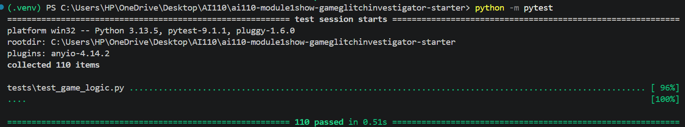
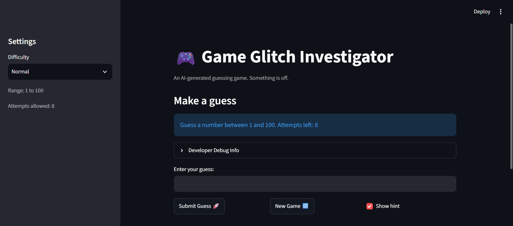
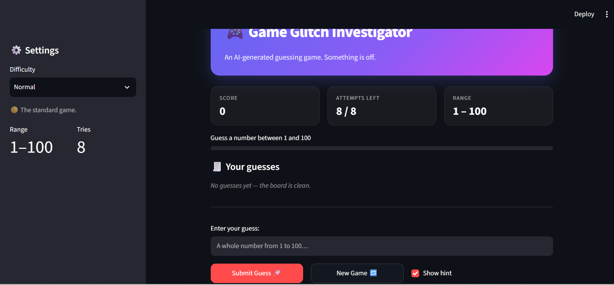

# 🎮 Game Glitch Investigator: The Impossible Guesser

## 🚨 The Situation

You asked an AI to build a simple "Number Guessing Game" using Streamlit.
It wrote the code, ran away, and now the game is unplayable. 

- You can't win.
- The hints lie to you.
- The secret number seems to have commitment issues.

## 🛠️ Setup

1. Install dependencies: `pip install -r requirements.txt`
2. Run the broken app: `python -m streamlit run app.py`

## 🕵️‍♂️ Your Mission

1. **Play the game.** Open the "Developer Debug Info" tab in the app to see the secret number. Try to win.
2. **Find the State Bug.** Why does the secret number change every time you click "Submit"? Ask ChatGPT: *"How do I keep a variable from resetting in Streamlit when I click a button?"*
3. **Fix the Logic.** The hints ("Higher/Lower") are wrong. Fix them.
4. **Refactor & Test.** - Move the logic into `logic_utils.py`.
   - Run `pytest` in your terminal.
   - Keep fixing until all tests pass!

## 📝 Document Your Experience

- [ ] This is a number guessing game. The user is to guess a random secret number between 1 and 100 and the game incorporates the "hot" and "cold" hint system with "higher" and "lower" to guide them to the correct secret number.
- [ ] I found a total of 4 bugs: Numbers outside the range were accepted, Invalid guesses like letters and blank space affected the attempted guesses number, Number of attempts reduce by 1 by the 2nd guess instead of the 1st
- [ ] The fixes I applied were: Guesses with numbers outside the range triggered an error message while attempts remained static instead of decreasing by 1, Invalid guesses like letters and blank space did not affect the no. of attempted guesses and threw an error to warn the player.

## 📸 Demo Walkthrough

Describe your fixed game in numbered steps so a reader can follow along without watching a video:
Assume secret number is 60
1. User submits 40
2. Game says "higher"
3. Attempts are now 7
4. User submits 70
5. Game says "lower"
6. Attempts are now 6
7. User mistakenly submits a blank space
8. Game throws error saying "Enter a guess"
9. No. of attempts remain the same
10. User inputs 60
11. Game says "congrats"

**Screenshot** *(optional)*: <!-- Insert a screenshot of your fixed, winning game here -->

## 🧪 Test Results

```
# Paste your pytest output here, e.g.:
# pytest tests/


# ========================= X passed in 0.XXs =========================
```

## 🚀 Stretch Features

- [ ] [If you choose to complete Challenge 4, describe the Enhanced UI changes here — a screenshot is optional]
# UI CHANGES
- Gradient hero header
- Three-card scoreboard
- A progress bar
- A visual guess history
BEFORE: 
AFTER: 
